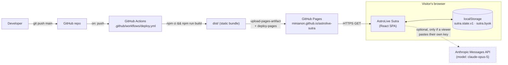
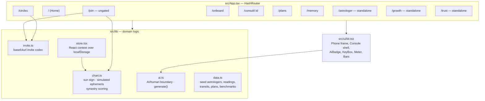
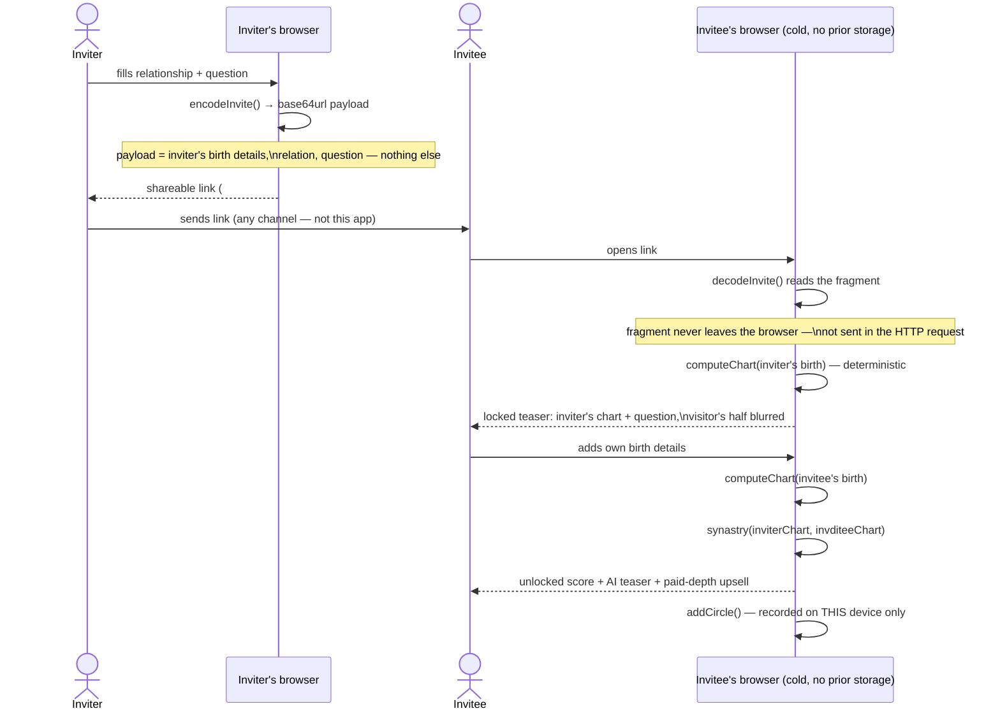
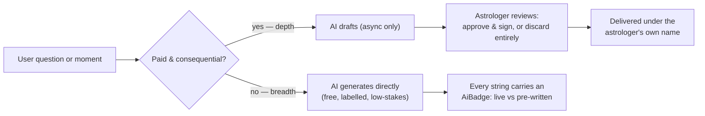
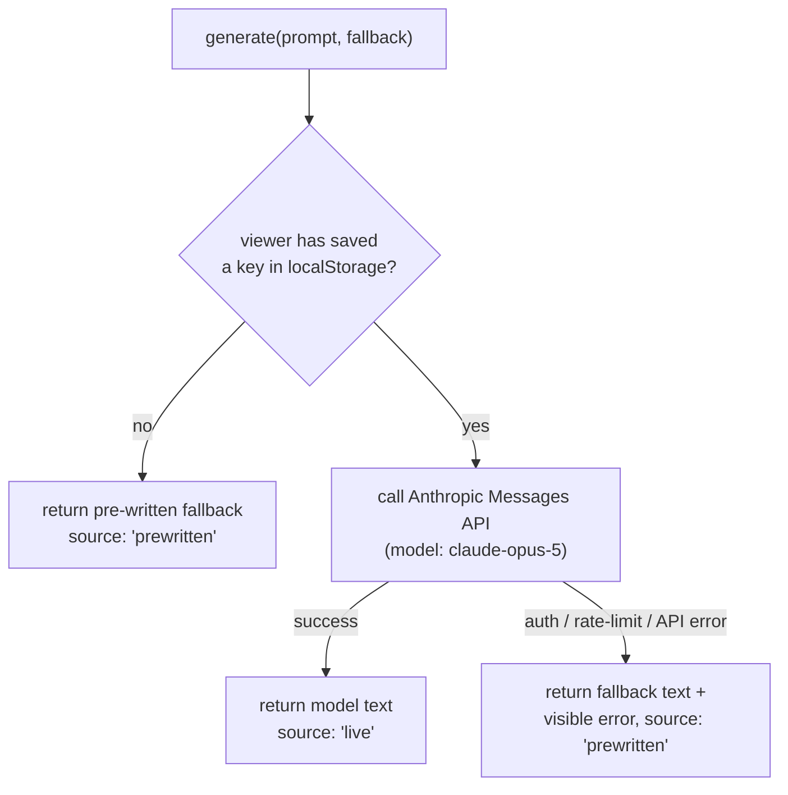

# High-Level Design — AstroLive Sutra

> Companion to [../README.md](../README.md) and the [LLD](./LLD.md). This document describes
> the system at the architecture level: what runs where, how the four product modules relate,
> and the trust boundary between AI and human astrologers. For type-level detail, function
> signatures and sequence-level flows, see the LLD.

## 1. What this is

AstroLive Sutra is a client-only prototype built for AstroHack 2026, addressing four structural
gaps in AstroLive's current product: no built-in growth loop, no daily habit, revenue capped by
astrologer supply-hours, and no continuity across readings. It ships as four interlocking
modules — **Sutra Invite** (virality), **Transit Feed** (habit), **AI Copilot & async answers**
(new revenue / supply unlock), and **Sutra Memory** (retention/USP) — described in full in the
written report (`report/report.html`).

## 2. System context

The defining architectural constraint: **no backend**. Everything ships as a static bundle to
GitHub Pages. State lives in the visitor's own browser; the one exception is the optional
"bring-your-own-key" tier, which talks directly from the browser to Anthropic's API.

There is deliberately no application server, no database, and no third-party analytics. The
only network calls the deployed app ever makes are: (a) loading its own static assets, and
(b) the optional direct-to-Anthropic call, made only after a viewer supplies their own API key.

## 3. Module map

Every screen is a thin consumer of `lib/`; none of the domain logic (chart computation, invite
encoding, the AI boundary) lives inside a component. This is what let the invite mechanic and
the synastry engine be verified independently of the UI during testing.

## 4. The no-backend growth loop, end to end

This is the single mechanic the whole acquisition thesis rests on, so it is worth diagramming
at the architecture level (the LLD has the call-by-call version).

The last step is the one architectural compromise worth naming explicitly: with no backend, the
inviter's own device never learns the invite was accepted. A production build would close that
loop with a push notification or a lightweight sync endpoint; the prototype states this
limitation in-product rather than hiding it.

## 5. The AI / human trust boundary

The product's central architectural rule, enforced as data (`AI_SURFACES` in `src/lib/ai.ts`)
rather than left as a convention:

| | AI-owned (breadth) | Human-signed (depth) |
|---|---|---|
| **Who** | The model, unlimited | A named, accountable astrologer |
| **Cost to user** | Free | Paid (₹/min or async pack) |
| **Examples** | Daily transit card, chart explainer, question framing, synastry teaser, consult-note structuring, memory search | Live consultation, async answer draft **review**, remedies & muhurat, full synastry reading |
| **Failure mode if inverted** | — | An unsupervised AI oracle is already commoditised (AstroGPT, Om.AI, AstroSage) and cannibalises the ₹10–15/min marketplace |

No code path returns a paid, model-generated answer without a human review step in between —
this is verifiable directly in `src/lib/ai.ts` (`AI_SURFACES`) and `src/screens/Astrologer.tsx`.

## 6. AI execution: two tiers, no baked-in secret

A public static build cannot hold a secret, so no API key is ever bundled with the site. The
live tier exists purely so a reviewer can *watch* generation happen; its absence never breaks
the experience — every failure path degrades to the same pre-written text a key-less visitor
already sees, with the error surfaced rather than swallowed.

## 7. Deployment

| Stage | Mechanism |
|---|---|
| Build | `tsc -b && vite build`, output to `dist/` |
| CI trigger | Any push to `main` (`.github/workflows/deploy.yml`) |
| CI steps | checkout → setup-node@20 → `npm ci` → `npm run build` → `configure-pages` → `upload-pages-artifact` → `deploy-pages` |
| Host | GitHub Pages, source = GitHub Actions |
| Routing | `HashRouter` — required because Pages 404s on unknown static paths; hash-based routes never hit the server, so deep links (including invite links) survive a cold load |
| Base path | `/astrolive-sutra/`, set in `vite.config.ts` |

## 8. Non-functional notes

- **Privacy** — birth details travel only inside the URL fragment (never sent over HTTP) and in
  `localStorage`. No account system, no server-side storage of any kind.
- **Determinism** — chart computation is a pure hash of birth details (`cyrb128` + `mulberry32`
  PRNG), not `Math.random()`. The same two people always produce the same synastry score,
  computed independently on either side — required for a link-based, no-backend architecture.
- **Security** — the only secret in the system is a viewer-supplied Anthropic API key, held in
  that browser's `localStorage` and never transmitted anywhere but Anthropic's API.
- **Known limitations** — no real ephemeris beyond the sun sign, no payments, no cross-device
  sync (§4); all stated explicitly in the report and in-product rather than hidden.
