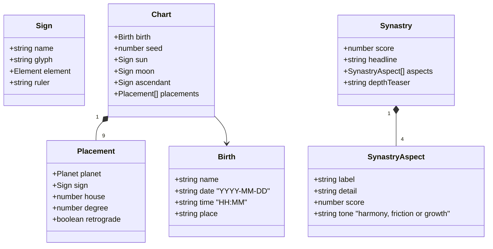
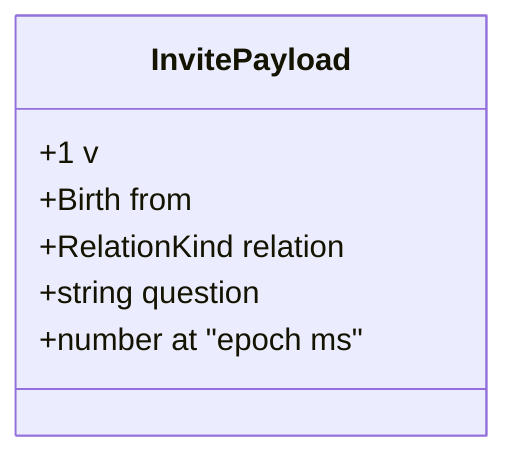
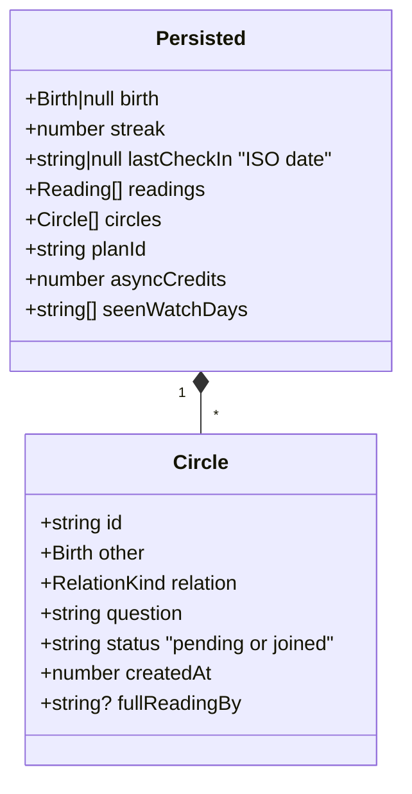
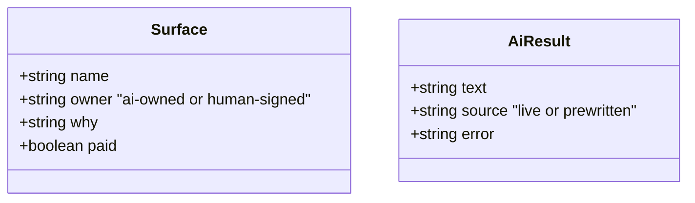
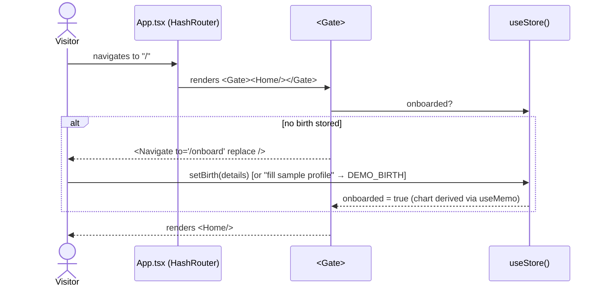
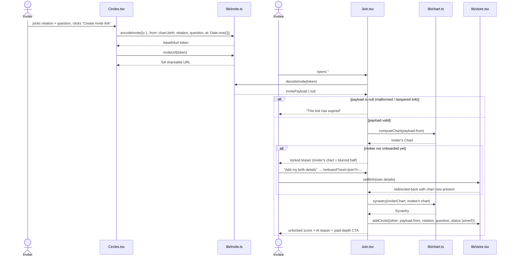
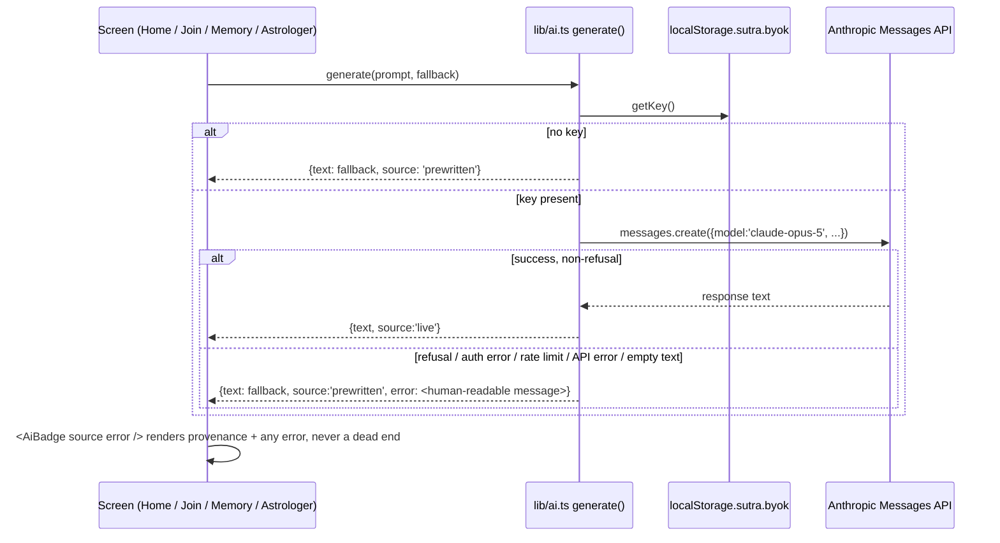
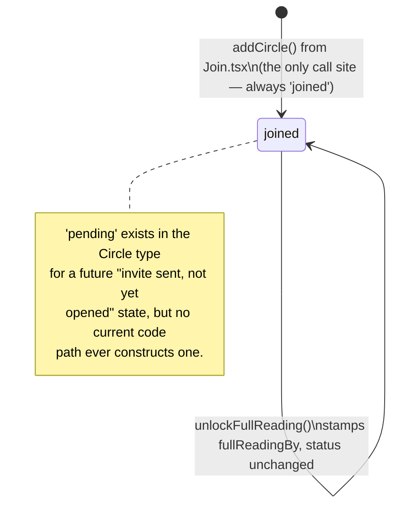
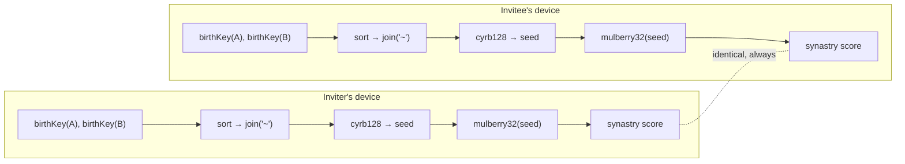

# Low-Level Design — AstroLive Sutra

> Companion to [HLD.md](./HLD.md). That document covers system architecture; this one covers
> the actual types, function signatures, and call sequences, all read directly from `src/`.

## 1. Directory structure

```
src/
├── App.tsx                 # HashRouter + route table + <Gate> guard
├── main.tsx                # React root
├── lib/
│   ├── chart.ts             # sun sign + simulated ephemeris + synastry scoring
│   ├── invite.ts             # base64url invite payload codec (no backend)
│   ├── store.tsx             # React context over localStorage
│   ├── ai.ts                 # AI/human boundary data + generate() + prompts
│   └── data.ts                # seed astrologers, readings, transits, plans, benchmarks
├── ui/
│   └── kit.tsx                 # Phone frame, Console shell, AiBadge, KeyBox, Meter, Bars, Avatar
└── screens/
    ├── Onboard.tsx   Home.tsx   Circles.tsx   Join.tsx   Consult.tsx
    ├── Astrologer.tsx   Plans.tsx   Memory.tsx   Growth.tsx   Trust.tsx
```

## 2. Domain model

### 2.1 Chart engine (`lib/chart.ts`)



**`Element = 'Fire' | 'Earth' | 'Air' | 'Water'`** — each of the 12 `SIGNS` carries one.

| Function | Signature | Behaviour |
|---|---|---|
| `sunSign` | `(isoDate: string) => Sign` | **Real.** Tropical-zodiac cusp table (`CUSP`), correct for any date. |
| `cyrb128` | `(str: string) => number` | 128-bit-strength string hash → 32-bit seed. Deterministic. |
| `mulberry32` | `(seed: number) => () => number` | Seeded PRNG. Same seed ⇒ same output sequence, always. |
| `birthKey` | `(b: Birth) => string` | `"${date}\|${time}\|${place.trim().toLowerCase()}"` — the hash input. |
| `computeChart` | `(birth: Birth) => Chart` | Seeds PRNG from `birthKey`; sun is real, all other placements are `SIGNS[⌊rnd()×12⌋]`, house `1–12`, degree `0.00–28.99`, retrograde only for non-luminary/non-Rahu planets at `p < 0.18`. |
| `synastry` | `(a: Chart, b: Chart) => Synastry` | Seed = `cyrb128([birthKeyA, birthKeyB].sort().join('~'))` — **sorted before joining**, which is what makes the score identical regardless of which side computes it first. |

**Synastry scoring** — a weighted blend of element-affinity lookups, not the seeded RNG:

```
score = round(affinity(sunA,sunB)×0.40 + affinity(moonA,moonB)×0.38 + affinity(ascA,ascB)×0.22)
```

`ELEMENT_AFFINITY` is a fixed 4×4 table (e.g. Fire↔Air = 90, Fire↔Water = 48). A 4th aspect,
the "ruling-planet exchange" (`moonA.ruler ↔ sunB.ruler`), *is* drawn from the pair-seeded RNG
(`45 + ⌊rnd()×50⌋`) — the only aspect that isn't a pure affinity lookup.

> **Correctness note.** `aspects` is built in a fixed order (Sun, Moon, Ascendant,
> ruler-exchange) — it is *not* sorted by score. Any caller that wants "the strongest axis"
> must sort a copy first (`[...aspects].sort((a,b) => b.score - a.score)[0]`). `lib/ai.ts` does
> this correctly as of the current build; a prior version assumed `aspects[0]` was the
> strongest, which produced a real bug (strength and friction naming the same axis) — fixed by
> sorting explicitly in both `synastryPrompt()` and `prewrittenSynastry()`.

### 2.2 Invite codec (`lib/invite.ts`)



`RelationKind = 'partner' | 'spouse' | 'family' | 'friend' | 'colleague'`

| Function | Signature | Behaviour |
|---|---|---|
| `toBase64Url` / `fromBase64Url` | `(bytes) => string` / `(s) => Uint8Array` | Unicode-safe base64url (handles non-ASCII names); `+`→`-`, `/`→`_`, no padding. |
| `encodeInvite` | `(p: InvitePayload) => string` | `toBase64Url(utf8(JSON.stringify(p)))`. |
| `decodeInvite` | `(token: string \| null) => InvitePayload \| null` | Parses and validates `v === 1 && from.date && from.name`; **returns `null` on anything malformed rather than throwing** — a broken link must degrade, not crash. |
| `inviteUrl` | `(token: string) => string` | `${origin}${pathname}#/join?i=${token}` — reads `window.location` live, so it's correct under the Pages base path (`/astrolive-sutra/`) automatically. |

The payload is deliberately carried in the URL **fragment** (`#/join?i=...`), not a query
string: fragments are never transmitted in the HTTP request, so a third-party host (GitHub
Pages) never sees the birth details it's serving a page for.

### 2.3 Store (`lib/store.tsx`)



Persistence key: `localStorage['sutra.state.v1']`. `load()` shallow-merges parsed JSON over
`EMPTY` so an older stored shape never crashes a newer build.

| Store action | Effect |
|---|---|
| `setBirth(birth)` | Sets `state.birth`; `chart` is a `useMemo` derived from it, so onboarding completes the moment this is called. |
| `checkIn()` | Streak logic: same-day call is a no-op; a 1-day gap increments the streak; any larger gap resets it to 1. |
| `addCircle(c)` | Appends a `Circle` with a random id — **called only from `Join.tsx`**, always with `status: 'joined'`. `'pending'` is defined in the type for forward-compatibility but no current code path emits it. |
| `markCircleJoined` / `unlockFullReading` | Present for a future paid-unlock flow; `unlockFullReading` also stamps `fullReadingBy`. |
| `spendCredit()` | Returns `false` (no-op) if `asyncCredits <= 0`, so callers can upsell instead of going negative. |
| `reset()` | Clears both in-memory state and the localStorage key. |

**Demo seeding** — `wantsDemo()` checks `?demo=1`/`&demo=1` in `location.hash` or
`location.search`. If present *and* no birth is stored yet, `StoreProvider`'s initial `useState`
seeds `DEMO_BIRTH` (hardcoded: Tushar Bhardwaj, 2001-08-14, 06:20, Bengaluru) with a backdated
`lastCheckIn` so the streak reads as already-in-progress. **This value ships in the public
bundle** — see the README's "known limitation" note before treating it as disposable test data.

### 2.4 AI layer (`lib/ai.ts`)



`AI_SURFACES: Surface[]` is the boundary encoded as data — see [HLD §5](./HLD.md#5-the-ai--human-trust-boundary)
for the table. `MODEL = 'claude-opus-5'`.

| Function | Signature | Notes |
|---|---|---|
| `getKey` / `setKey` / `hasKey` | localStorage read/write around key `sutra.byok` | Wrapped in try/catch — private-mode browsers that block storage simply leave the live tier off, silently. |
| `transitPrompt`, `synastryPrompt`, `memoryPrompt` | `(...) => string` | Pure prompt builders; no I/O. `synastryPrompt` sorts `aspects` by score to name the true strongest/weakest axis (see §2.1 correctness note). |
| `generate` | `(prompt: string, fallback: string) => Promise<AiResult>` | No key → immediate fallback. Key present → calls `Anthropic.messages.create`; a `refusal` stop reason, any thrown `AuthenticationError`/`RateLimitError`/`APIError`, or an empty response all resolve to `{ text: fallback, source: 'prewritten', error }` rather than rejecting. |
| `prewrittenTransit`, `prewrittenSynastry`, `prewrittenMemoryAnswer` | pure functions | The fallback text `generate()` uses when there's no key or the live call fails. `prewrittenSynastry` derives best/worst from a sorted copy of `aspects` (fixed alongside the prompt version). |

## 3. Sequence: onboarding → gated route



`/join` is the one gated-looking route that is **not** wrapped in `<Gate>` — a stranger with no
chart must be able to load it and see the locked teaser before onboarding.

## 4. Sequence: full invite lifecycle



**Note on state symmetry** (stated plainly, not glossed over): `addCircle` runs on the
**invitee's** device only. The inviter's own `state.circles` is never updated by this flow — the
prototype has no backend to notify it. Re-opening the same invite link on the inviter's own
device (e.g. via the "Preview" button) does add a self-referential circle for demo purposes,
but that is a side effect of testing, not real cross-device sync. A production build would close
this with either a lightweight sync endpoint or a push notification, as noted in-product.

## 5. Sequence: AI generation with graceful degradation



## 6. State diagram: `Circle.status`



## 7. Routing table (`App.tsx`)

| Path | Component | Gated? | Notes |
|---|---|---|---|
| `/onboard` | `Onboard` | — | Accepts `?next=<path>` to return to after birth details are set |
| `/join` | `Join` | **No** | Must render for a chart-less stranger |
| `/` | `Home` | Yes | Daily transit card, streak, watch-days |
| `/circles` | `Circles` | Yes | Invite creation + circle list |
| `/consult/:id` | `Consult` | Yes | |
| `/plans` | `Plans` | Yes | |
| `/memory` | `Memory` | Yes | Sutra Memory search |
| `/astrologer` | `Astrologer` | No (standalone console) | Desktop-width supply-side view |
| `/growth` | `Growth` | No (standalone) | Live growth-model simulator |
| `/trust` | `Trust` | No (standalone) | AI/human boundary + `KeyBox` |
| `*` | — | — | `<Navigate to="/" replace />` |

## 8. Determinism, illustrated

The property that makes the whole no-backend architecture work: two independent computations
of the same pair always converge.



Sorting the two `birthKey` strings before joining is what makes the seed — and therefore the
score — independent of which side (inviter or invitee) computed it first.
